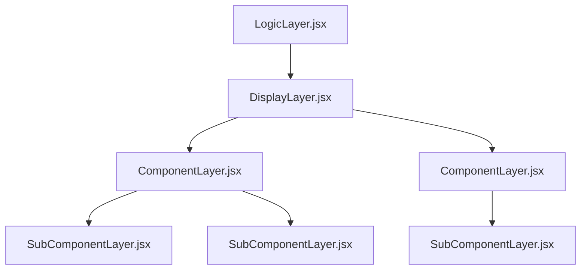

# Project Files Desgin Patterns

Projects, components and subcomponents should adhere to SOLID progamming principles when applicable. 

Files should be layered to seperate concerns, the general page design pattern is:

## LogicLayer.jsx

The primary role of Logic Layers state management, display logic.

Example Logic layers would be the App.jsx file, Page.jsx files in multipage projects, and Component.jsx files in complex components with their own state and subcomponents.

Use the Logic layer as a Storage global state and for making global API calls.

Logic should remain pure, emphasising clean modular structuring in adherence to best practices.

Logic should only be concerned with the logic flow, and abstain from direct code implementation within the flow, rather functions should be called, promoting separation of concerns.

Basic layout styling is handled at this layer via the return statement.

Segregating responsibilities in this manner allows the Logic layers to be maintainable, scalable and modular.

## DisplayLayer.jsx

The display layer is used when page views are required. In this layer components are called and page specific state stored.

Display layers' primary concern is display of components on the page.

Logic can be present in the display layer, but this should be kept to the minimum, for example, in the react fragment return value if different components are displayed dependent upon state.

Generally speaking this layer should remain relatively small.

## Component layer

Treating React Components as [Micro Frontends](https://micro-frontends.org/) allows for compartmentalisation of code and isolation of interests between components. In this design pattern each component is isolated from others. This allows for modularity and reusability of 

Component layers can use state and logic that is component specific, preferably keeping functions in a seperate subfile. 

As a general rule for complext components, the component layer should not contain complex html fragments, rather organise complex html into subcomponents and pass down variables by props. In this way the component layer acts as a display layer. In simple components, treat them like subcomponents.

The specific display intricacies of complex components are delegated to the subcomponent layer, promoting a hierarchical structure that enhances code organization and readability.

## Subcomponent layer

In complex components, subcomponents can be used, subcomponents differ from external functions in that they are display modules with React code.

Subcomponents are used to break code down to make it more readable, allow for specific unit testing if required, and make code more modular.

Subcomponents should not contain state, all state should be contained either in the global, page or parent component layers dependant upon state needs. All required state should be passed down props and subcomponents should be Arrow functions with implicit returns.
